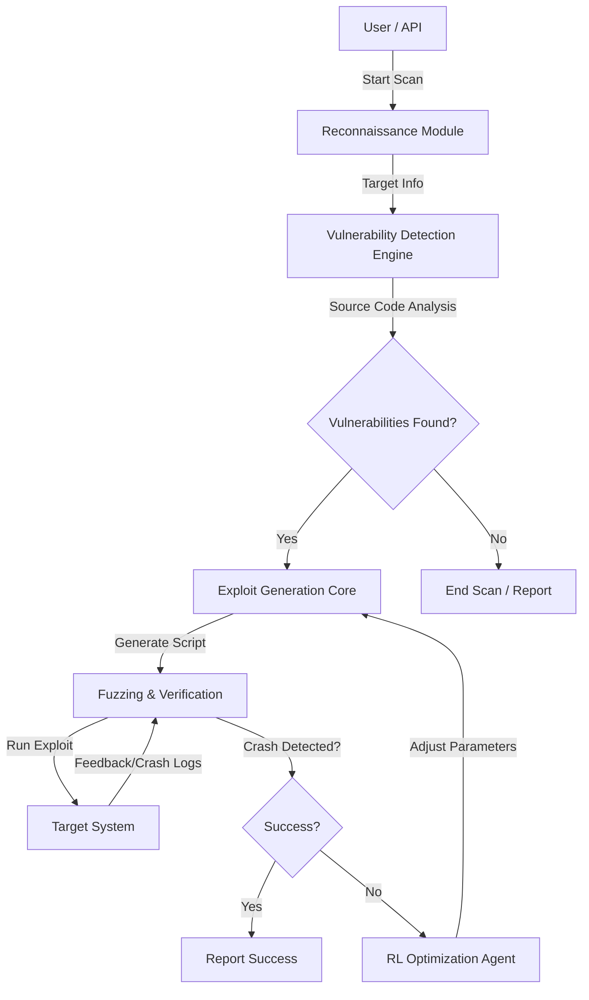

# Scope of Work: PayloadFactoryUX

## 1. Project Purpose (Introduction)
The purpose of the **PayloadFactoryUX** project is to develop a comprehensive, AI-driven automated pipeline for Capture The Flag (CTF) competitions and professional vulnerability assessment. The system aims to bridge the gap between manual security research and automated tools by leveraging advanced Machine Learning (ML) and Large Language Models (LLM).

The core objective is to create a unified platform that autonomously performs reconnaissance, detects vulnerabilities in source code using semantic analysis, generates custom exploit scripts, and validates them through fuzzing and Reinforcement Learning (RL). This project seeks to enhance the efficiency of security researchers by automating the "find-and-exploit" loop while providing a user-friendly interface for managing assessments.

## 2. System Flow Chart
The following diagram illustrates the automated pipeline workflow:

## 3. Scope Description

### i. In-Scope
The following functionalities and activities are included in the project scope:

*   **Reconnaissance Module**:
    *   Development of automated tools for target analysis.
    *   Implementation of HTTP header inspection, server version detection, and attack surface mapping.
    *   Implementation of HTTP header inspection, server version detection, and attack surface mapping.
    *   **Source Code Retrieval**: Automated extraction of source code *only* if exposed directly on the target server (e.g., via `.zip`, `.tar.gz` backups, or exposed `.git` directories).
    *   **Manual Input Fallback**: Option for the user to manually upload or paste source code if automated retrieval fails.

*   **Vulnerability Detection Engine**:
    *   Integration of static analysis tools using fine-tuned Transformer models.
    *   Deployment of **UnixCoder** (fine-tuned for C/C++) and **GraphCodeBERT** for semantic vulnerability detection.
    *   Support for detecting common vulnerability classes (Buffer Overflows, SQLi, etc.) in source code.

*   **Exploit Generation Core**:
    *   Implementation of a Generative AI module using **Hermes 3 8B** (Llama-3.1 based).
    *   Fine-tuning of the LLM using **QLoRA** (4-bit quantization) on exploit datasets (e.g., ExploitDB) to generate functional python exploit scripts.
    *   Context-aware payload generation based on detected vulnerabilities.

*   **Fuzzing & Verification**:
    *   Development of a mutation-based fuzzing engine to validate potential crashes.
    *   Automated execution of generated exploits against targets to verify success.
    *   Crash detection and logging mechanisms.

*   **Reinforcement Learning (RL) Optimization**:
    *   Implementation of a Q-Learning agent to optimize exploit payloads.
    *   Feedback loop integration where the agent learns from fuzzing results to adjust payload parameters (length, padding, etc.) for higher reliability.

*   **Backend API & Orchestration**:
    *   Development of a **FastAPI**-based backend server to manage the pipeline.
    *   RESTful endpoints for triggering reconnaissance, scans, generation, and fuzzing tasks.

*   **User Interface (UX)**:
    *   Creation of a graphical dashboard ("PayloadFactoryUX") to visualize scan results.
    *   Interfaces for configuring scans, viewing detected vulnerabilities, and managing generated exploits.

### ii. Out of Scope
The following items are explicitly excluded from this project to prevent scope creep:

*   **Social Engineering**: No features related to phishing, spear-phishing, or human-centric attacks.
*   **Automated Online Repository Search**: The system will *not* autonomously search external platforms (GitHub, GitLab) for source code based on metadata. This is excluded to reduce complexity and legal risks.
*   **Physical Security**: No assessment of physical access controls or hardware tampering.
*   **Denial of Service (DoS) Tools**: The system is not designed to perform or sustain DoS/DDoS attacks; fuzzing is limited to crash detection, not service disruption.
*   **Cloud Infrastructure Management**: No features for managing or auditing cloud provider configurations (AWS IAM, Azure Policies) unless directly related to the target application code.
*   **Mobile Application Scanning**: The scope is limited to server-side and web application code; mobile binary analysis (APK/IPA) is excluded.
*   **General IT Support**: No provision for general IT troubleshooting or network setup beyond what is required for the tool's operation.

## 4. Deliverables
The project will result in the following tangible deliverables:

### 4.1 User-Facing Outputs
The system will present the following detailed information to the user for each scan:

*   **Vulnerability Report**:
    *   **Detected Vulnerability**: The specific type of flaw found (e.g., "Stack-based Buffer Overflow").
    *   **Severity**: Rated as Low, Medium, High, or Critical.
    *   **Location**: File path and specific line number(s) where the vulnerability exists.
    *   **Code Snippet**: The exact block of code flagged by the scanner.
    *   **Classification**:
        *   **CWE ID**: Common Weakness Enumeration identifier (e.g., CWE-121).
        *   **CVE ID**: Common Vulnerabilities and Exposures reference (if applicable to a known library/version).
        *   **OWASP Category**: Mapping to OWASP Top 10 (e.g., A03:2021-Injection).
*   **Exploit Artifacts**:
    *   **Generated Exploit Script**: A fully functional Python script targeting the detected vulnerability.
    *   **Payload Details**: The specific payload string used (e.g., shellcode or injection string).
    *   **Verification Status**: Success/Failure status from the fuzzing engine.

### 4.2 System Artifacts
1.  **Source Code Repository**:
    *   Complete, documented Python codebase for `ml_engine` (Recon, Vuln, Exploit, Fuzz, RL).
    *   Backend server code (`server/app`).
    *   UI/Frontend code.
2.  **Trained Model Artifacts**:
    *   Fine-tuned LoRA adapters for **Hermes 3 8B**.
    *   Fine-tuned weights for **UnixCoder** and **GraphCodeBERT**.
3.  **Datasets**:
    *   Processed and cleaned datasets used for training (e.g., `custom_exploit_dataset.jsonl`).
4.  **Documentation**:
    *   **Scope of Work** (This document).
    *   **Implementation Plan**: Technical design and architecture details.
    *   **Walkthrough/User Guide**: Instructions for installation, configuration, and usage.
5.  **Test Reports**:
    *   Summary of verification tests and model performance metrics.

## 5. Assumptions
*   **Hardware Availability**: It is assumed that the development and deployment environment has access to a GPU with at least **12GB VRAM** (e.g., NVIDIA RTX 5070) to support the LLM and training workloads.
*   **Data Access**: We assume access to necessary public datasets (ExploitDB, DiverseVul) and that they are sufficient for the intended model performance.
*   **Target Authorization**: It is assumed that all testing and scanning performed with this tool will be against authorized targets (CTF challenges or owned infrastructure).
*   **Dependency Stability**: We assume that key libraries (PyTorch, Transformers, PEFT) remain stable and backward compatible during the development phase.

## 6. Constraints
*   **Resource Constraints**:
    *   **Compute**: The system must be optimized to run on a single high-end consumer workstation (Single GPU). Large-scale cluster training is not feasible.
    *   **Memory**: The LLM component is strictly limited to 4-bit quantized inference to fit within available VRAM.
*   **Timeline**:
    *   The project timeline is subject to the successful fine-tuning of models, which can be time-intensive.
    *   [Specific Date/Duration to be inserted by Stakeholders]
